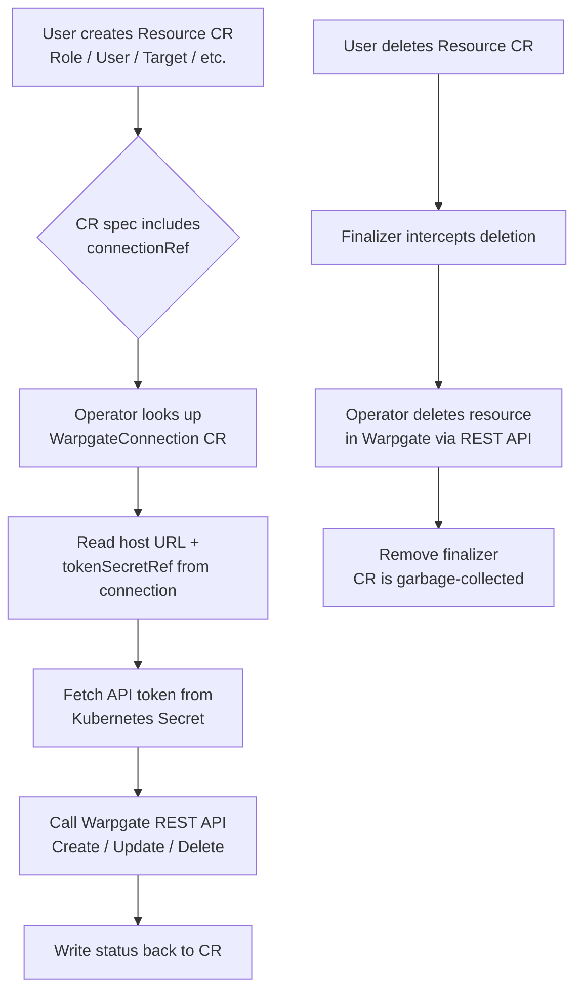
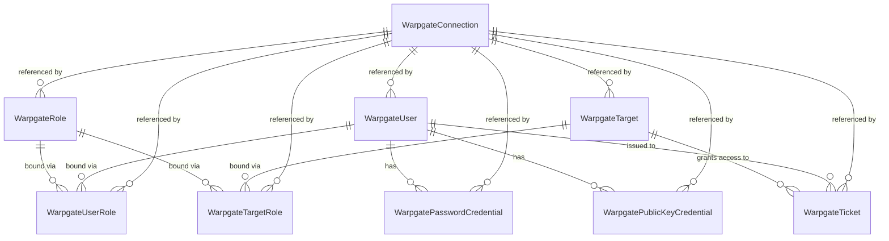

# Warpgate Operator

[](https://github.com/thereisnotime/warpgate-operator/actions/workflows/ci.yml)
[](https://goreportcard.com/report/github.com/thereisnotime/warpgate-operator)
[](LICENSE)
[](go.mod)
[](https://github.com/thereisnotime/warpgate-operator/releases)

A Kubernetes operator that manages [Warpgate](https://github.com/warp-tech/warpgate) bastion host resources
declaratively through Custom Resource Definitions. Define your Warpgate roles, users, targets, credentials, and
access tickets as Kubernetes manifests and let the operator handle the REST API calls, drift reconciliation, and
lifecycle management.

## Table of Contents

- [Features](#features)
- [Installation](#installation)
- [Quick Start](#quick-start)
- [CRD Reference](#crd-reference)
- [Architecture](#architecture)
- [Roadmap](#roadmap)
- [Contributing](#contributing)
- [License](#license)

## Features

- **9 CRDs** covering all Warpgate resource types -- connections, roles, users, targets, bindings, credentials, and tickets
- **Multi-instance support** via `WarpgateConnection` CRDs pointing to different Warpgate instances
- **Continuous drift reconciliation** that enforces desired state every 5 minutes
- **Secret references** for sensitive fields -- no inline tokens or passwords in CRD specs
- **Finalizer-based cleanup** that removes Warpgate resources when CRs are deleted
- **Auto-generated passwords** for users, stored in Kubernetes Secrets
- **Auto-created Secrets** for ticket values

## Installation

### Helm (recommended)

```bash
helm repo add warpgate-operator https://thereisnotime.github.io/warpgate-operator
helm repo update
helm install warpgate-operator warpgate-operator/warpgate-operator \
  --namespace warpgate-operator-system --create-namespace
```

### Kustomize / Raw Manifests

```bash
kubectl apply -f https://github.com/thereisnotime/warpgate-operator/releases/latest/download/install.yaml
```

## Quick Start

Create a Secret with your Warpgate admin API token, then define a connection, a role, and a user:

```yaml
apiVersion: v1
kind: Secret
metadata:
  name: warpgate-token
stringData:
  token: YOUR_WARPGATE_ADMIN_TOKEN
```

```yaml
apiVersion: warpgate.warpgate.warp.tech/v1alpha1
kind: WarpgateConnection
metadata:
  name: my-warpgate
spec:
  host: https://warpgate.example.com
  tokenSecretRef:
    name: warpgate-token
```

```yaml
apiVersion: warpgate.warpgate.warp.tech/v1alpha1
kind: WarpgateRole
metadata:
  name: developers
spec:
  connectionRef: my-warpgate
  name: developers
---
apiVersion: warpgate.warpgate.warp.tech/v1alpha1
kind: WarpgateUser
metadata:
  name: john-doe
spec:
  connectionRef: my-warpgate
  username: john.doe
```

See the [CRD reference](#crd-reference) for full field details and more examples.

## CRD Reference

All resources belong to the API group `warpgate.warpgate.warp.tech/v1alpha1`.

| Kind | Description | Docs |
|------|-------------|------|
| `WarpgateConnection` | Connection to a Warpgate instance | [docs/crds/warpgate-connection.md](docs/crds/warpgate-connection.md) |
| `WarpgateRole` | Role definition | [docs/crds/warpgate-role.md](docs/crds/warpgate-role.md) |
| `WarpgateUser` | User account with credential policy and auto-generated password | [docs/crds/warpgate-user.md](docs/crds/warpgate-user.md) |
| `WarpgateTarget` | Target host (SSH, HTTP, MySQL, PostgreSQL) | [docs/crds/warpgate-target.md](docs/crds/warpgate-target.md) |
| `WarpgateUserRole` | User-to-role binding | [docs/crds/warpgate-user-role.md](docs/crds/warpgate-user-role.md) |
| `WarpgateTargetRole` | Target-to-role binding | [docs/crds/warpgate-target-role.md](docs/crds/warpgate-target-role.md) |
| `WarpgatePasswordCredential` | Password credential for a user | [docs/crds/warpgate-password-credential.md](docs/crds/warpgate-password-credential.md) |
| `WarpgatePublicKeyCredential` | SSH public key credential for a user | [docs/crds/warpgate-public-key-credential.md](docs/crds/warpgate-public-key-credential.md) |
| `WarpgateTicket` | One-time access ticket (auto-creates Secret) | [docs/crds/warpgate-ticket.md](docs/crds/warpgate-ticket.md) |

## Architecture

### Reconciliation Flow



### CRD Relationship Model



Every resource CR references a `WarpgateConnection` by name (same namespace) via `connectionRef`. The operator
resolves the connection, reads the API token from the referenced Kubernetes Secret, and talks to the Warpgate
REST API. Roles are bound to users and targets through dedicated binding CRDs, while credentials and tickets
hang off users directly.

## Roadmap

- Webhook validation for CRD specs
- Kubernetes target type support
- SSO credential management
- Helm chart published to artifact hub
- Prometheus metrics and alerts
- Multi-architecture container images
- Comprehensive E2E test suite

## Contributing

See [CONTRIBUTING.md](CONTRIBUTING.md) for development setup, coding guidelines, and how to submit changes.

## License

Apache License 2.0. See [LICENSE](LICENSE) for the full text.
