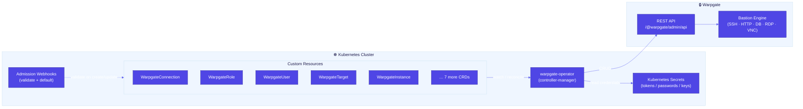
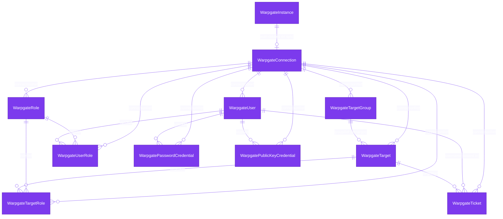
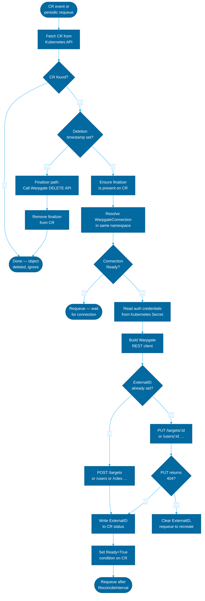
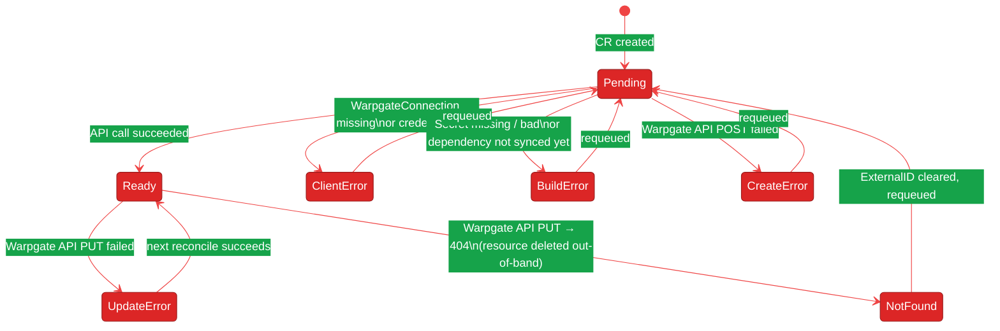
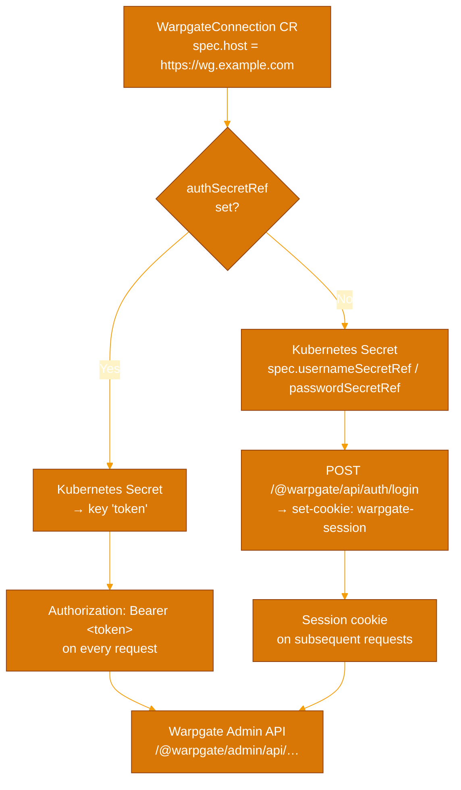
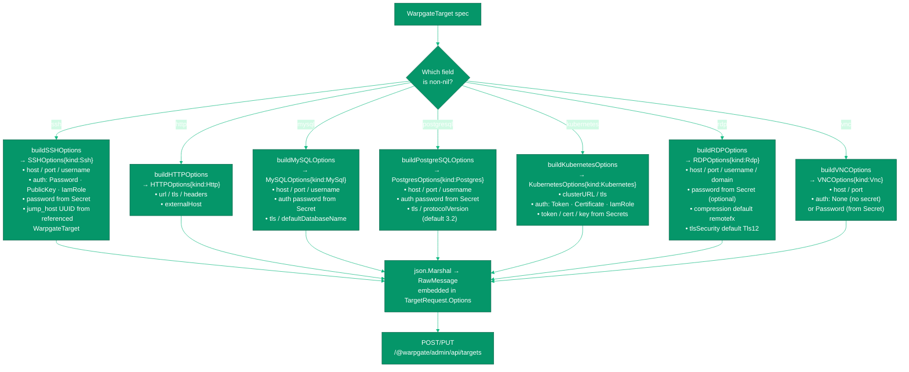
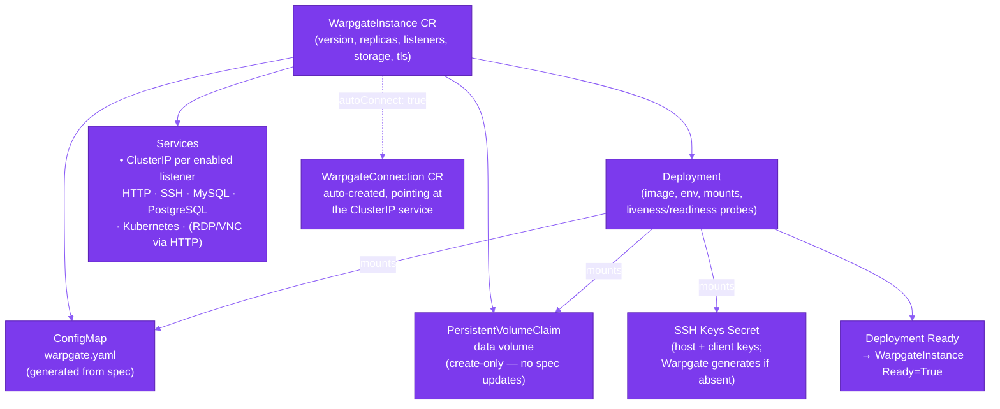

# Architecture

This document describes how the warpgate-operator is structured, how its components relate, and how it manages the lifecycle of Warpgate resources.

## Table of Contents

- [High-Level Overview](#high-level-overview)
- [Data Model](#data-model)
- [Reconciliation Flow](#reconciliation-flow)
- [Authentication Chain](#authentication-chain)
- [Target Type Dispatch](#target-type-dispatch)
- [WarpgateInstance Deployment](#warpgateinstance-deployment)
- [Controller Map](#controller-map)

---

## High-Level Overview

The operator bridges Kubernetes-native resource declarations with the Warpgate REST API. Every CRD is a desired-state declaration; the operator continuously drives actual state toward it.

---

## Data Model

Every resource CR declares a `connectionRef` pointing to a `WarpgateConnection`. The connection holds the URL and credentials needed to reach that Warpgate instance.
All other CRDs are siblings referencing the same connection; bindings link pairs of resources together.

---

## Reconciliation Flow

Every resource controller follows the same loop. The operator reconciles on CR changes and on a configurable periodic interval (default 5 minutes) to correct drift.

### Status Conditions

Every CR exposes a `Ready` condition. The `reason` field narrows down failures:

---

## Authentication Chain

The operator supports two auth modes against Warpgate: bearer token (preferred) and username/password session fallback. Both are resolved from Kubernetes Secrets.

---

## Target Type Dispatch

The target controller resolves which Warpgate options struct to build based on which field in the spec is non-nil. Exactly one type field is permitted (enforced by the admission webhook).

---

## WarpgateInstance Deployment

`WarpgateInstance` is the only CRD that manages Kubernetes workloads directly. It deploys Warpgate itself and optionally auto-creates a `WarpgateConnection` pointing to it.

---

## Controller Map

| Controller | Watches | Warpgate API endpoint | Notes |
|---|---|---|---|
| `WarpgateConnectionReconciler` | `WarpgateConnection` | — (validates connectivity) | No ExternalID; validates creds on each reconcile |
| `WarpgateInstanceReconciler` | `WarpgateInstance` | — (manages k8s workloads) | Creates Deployment, Services, PVC, ConfigMap |
| `WarpgateRoleReconciler` | `WarpgateRole` | `/roles` | Standard CRUD |
| `WarpgateUserReconciler` | `WarpgateUser` | `/users` | Auto-generates password; stores in Secret |
| `WarpgateTargetReconciler` | `WarpgateTarget` | `/targets` | 7 type dispatchers; secret lookups |
| `WarpgateTargetGroupReconciler` | `WarpgateTargetGroup` | `/target-groups` | Standard CRUD |
| `WarpgateUserRoleReconciler` | `WarpgateUserRole` | `/users/:id/roles/:id` | Waits for both User and Role to have ExternalID |
| `WarpgateTargetRoleReconciler` | `WarpgateTargetRole` | `/targets/:id/roles/:id` | Waits for both Target and Role to have ExternalID |
| `WarpgatePasswordCredentialReconciler` | `WarpgatePasswordCredential` | `/users/:id/credentials` | Reads password from Secret |
| `WarpgatePublicKeyCredentialReconciler` | `WarpgatePublicKeyCredential` | `/users/:id/credentials` | Reads public key from Secret |
| `WarpgateTicketReconciler` | `WarpgateTicket` | `/tickets` | Writes generated ticket value to a Secret |
| `HTTPRouteWatcherController` | `HTTPRoute` (Gateway API) | — | Watches routes to trigger target reconciles |
